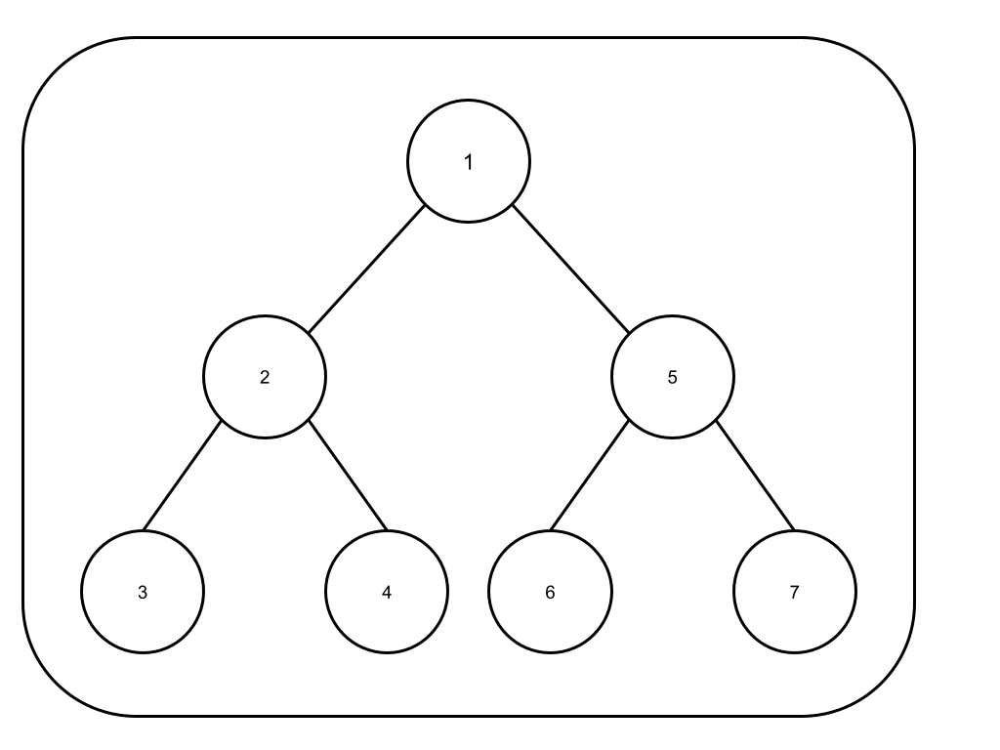

# بازیابی درخت (۱۲۰ امتیاز)

یک جستجوی عمق اول (`DFS`) در ریشه یک درخت دودویی اجرا کرده‌ایم و به ازای هر گره در این جستجو، ابتدا d خط تیره (که d عمق گره است) و سپس مقدار گره را در خروجی چاپ کرده‌ایم. اگر عمق یک گره d باشد، عمق فرزند مستقیم آن d + 1 است و عمق گره ریشه صفر است. اگر یک گره تنها یک فرزند داشته باشد، می‌دانیم که آن فرزند حتما در سمت چپ قرار دارد.

با گرفتن خروجی جستجوی بالا، گراف اصلی را به شکل استاندارد برگردانید.

## مثال‌ها

### مثال ۱:



ورودی:

```
1-2--3--4-5--6--7
```

خروجی:

```
[1,2,5,3,4,6,7]
```

### مثال ۲:


ورودی:

```
1-2--3---4---5-6--7---8
```

خروجی:

```
[1,2,6,3,null,7,null,4,5,8]
```
